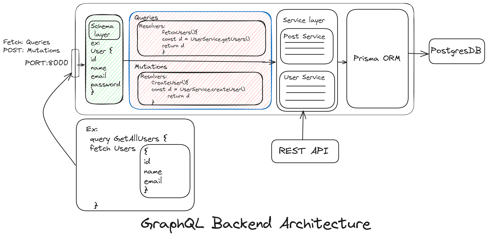

# GraphQL Backend



## Overview

This repository houses the backend implementation of a GraphQL server built using TypeScript, PostgreSQL, and Prisma as an ORM. The project adopts a structured architecture, featuring a service layer that manages CRUD operations between the GraphQL and the Prisma ORM.

## Features

- **GraphQL Endpoint:** The server exposes a GraphQL API endpoint to handle various data operations.Apollo server library is used. 

- **TypeScript:** The codebase is entirely written in TypeScript, offering static typing for improved code quality and developer experience.

- **PostgreSQL Database:** The backend utilizes PostgreSQL as the database for efficient data storage and retrieval.

- **Prisma ORM:** Prisma serves as the Object-Relational Mapping (ORM) tool, facilitating interactions with the database and data model management.

- **Service Layer:** A service layer acts as an intermediary between the GraphQ and database, encapsulating the business logic for CRUD operations.

## Installation

1. **Clone the repository:**

    ```bash
    git clone https://github.com/mohammadsahil01/GraphQL_backend.git
    ```

2. **Install dependencies:**

    ```bash
    cd your-repo
    npm install
    ```

3. **Set up environment variables:**
   - Copy the `.env.example` file to `.env` and fill in the required configuration values.

4. **Run migrations to create database tables:**

    ```bash
    npx prisma migrate dev
    ```

5. **Start the server:**

    ```bash
    npm start
    ```


